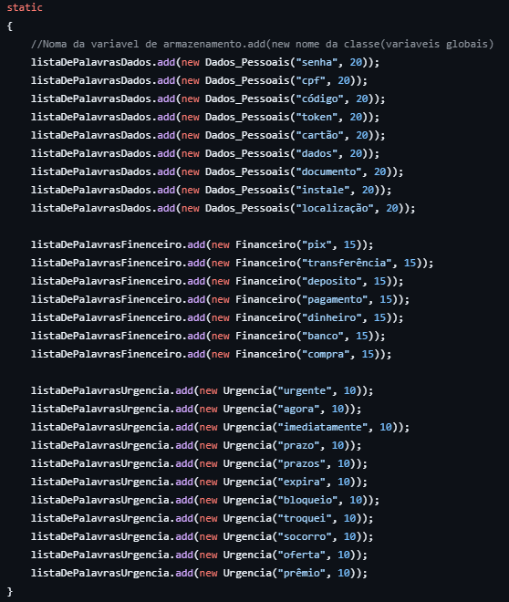
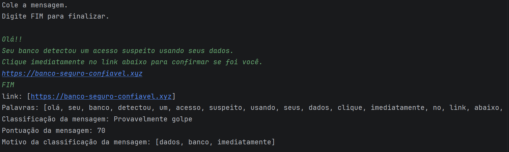
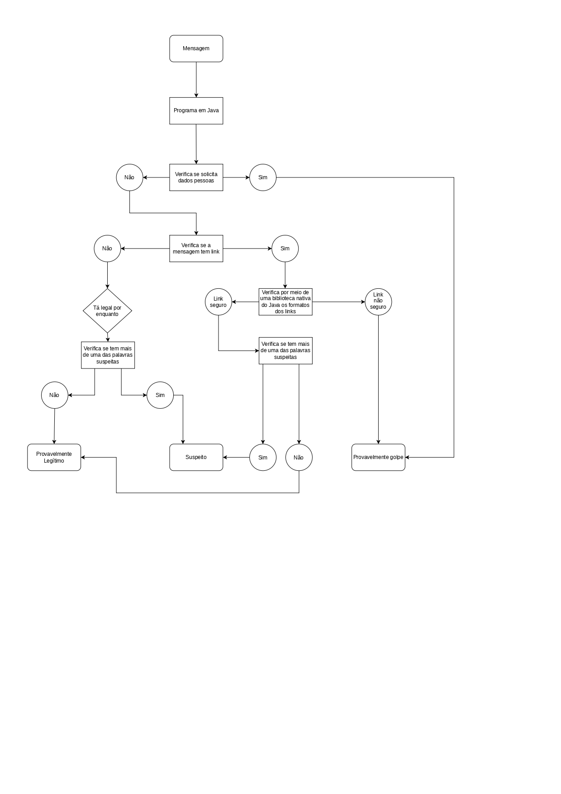
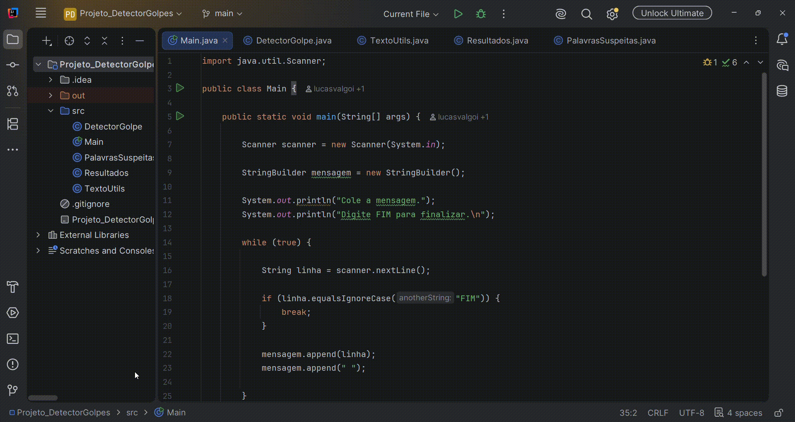

# Projeto detector de golpes

## Projeto feito com java para detectar possíveis golpes atráves de mensagens prontas.

O código deste projeto foi desenvolvido por um time de 3 pessoas - Eduarda Krug do Amaral, Lucas Luis Valgoi, João Guilherme Kempfer Bianchini - como solução para o Challenge 02 da Residência Full Stack 5.0. Residência do Instituto Eldorado em colaboração com a Petrobras.

### Funcionamento

O código começa a funcionar assim que o usuário envia a mensagem através do terminal, logo após, o código analisa se a mensagem possui: link desconhecido, solicitação de dados pessoais, urgência forçada e ofertas atrativas. Cada palavra encontrada no texto e que esteja em alguma das 3 listas, tais como - dados, banco, pix, imediatamente, urgente - somam para a pontuação final. 

As palavras estão separadas pelas classes “Dados_Pessoais”, “Financeiro” e “Urgência”, cada uma delas tendo uma quantidade de pontos pré definida em relação a classe que ela pertence.

Para a identificação do nível de risco da mensagem, criamos um sistema de pontuação com as seguintes categorias:

- 0 a 20 pontos - Provavelmente Legítma
- 20 a 40 pontos - Suspeita
- 40+ pontos - Provavelmente Golpe

Após a análise da mensagem, o código retorna o link enviado, as palavras da mensagem separadas em uma lista, a classificação e pontução. Por fim ela retorna uma lista de motivos que contém as palavras presentes na mesagem que obtiveram pontuação.

Demonstração prática da interação do usuário com o terminal:

"Olá!! Seu banco detectou um acesso suspeito usando seus dados. Clique imediatamente no link abaixo para confirmar se foi você https://banco-seguro-confiavel.xyz"

### Lógica aplicada no desenvolvimento do código

### Código explicado por um dos desenvolvedores

### Pré-requisitos para a instalação do código

Caso você se interessou pelo projeto e deseja testar em seu computador, essa é uma lista de programas necessários que precisam estar instalados em sua máquina para o funcionamento do código:

- Java, para o sistema operacional do computador reconhecer a linguagem;
- IDE para rodar o código (nós recomendamos a IntelliJ);
- Git para o versionamento do código.

### Instruções para rodar o código

Caso você não seja familiarizado com o versionamento de código e/ou não seja um desenvolver, aqui vai um passo a passo de como instalar e rodar o projeto em sua máquina:

1. Crie uma pasta em sua máquina;
2. Abra o git bash na pasta;
3. Clone o repositório;
4. Abra a pasta com o repositório clonado na IDE de sua preferência;
5. No canto superior da IDE clique em “RUN CODE”.

### Melhorias futuras

- Análise rigorosa das URL´S: usar requisições HTTPS para identificar tudo o que for possível a respeito da URL, como servidor, método usado, e se possível, acessar o conteúdo interno do link (será que é possível?)
- **Integrar banco de dados**: implementar suporte a um banco SQL para armazenar os termos utilizados para a pontuação das mensagens (imediatamente, banco, dados, pix…).

### Contatos

Caso você tenha gostado do nosso projeto e queira conhecer melhor os desenvolvedores, nos siga nas redes sociais!!

 - Eduarda Krug do Amaral
    - GitHub: @dudakrug
    - LinkedIn: Eduarda Krug
    - Email: dudakrugamaral@gmail.com
      
 - Lucas Luis Valgoi
    - GitHub: @lucasvalgoi
    - LinkedIn: Lucas Luis Valgoi
    - Email: lucasluisvalgoi@gmail.com
      
 - João Guilherme Kempfer Bianchini
    - GitHub: @Joaogui-Dev7
    - LinkedIn: João Bianchini
    - Email: joaogui.bianchini@gmail.com
